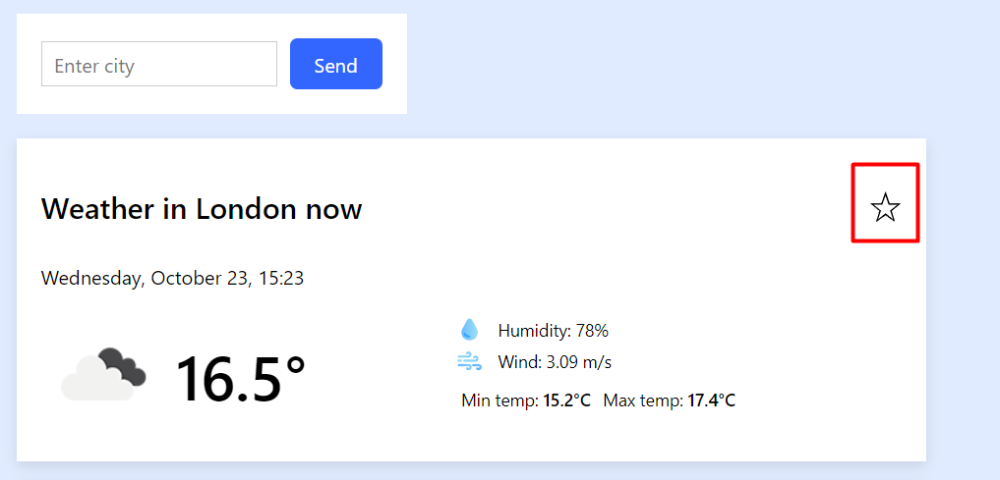
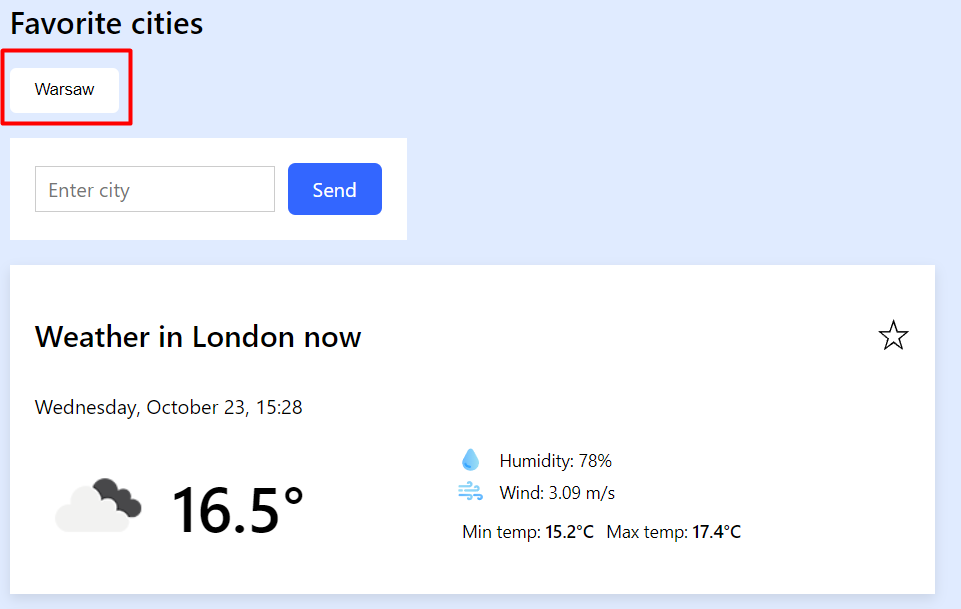

# Weather Dashbord

<a href="https://weather-dashboard-vert.vercel.app/">Application link.</a>

---

## Description
To add a city to your favorites, you need to click on the star button.
To remove a city from your favorites, click a second time

To view the weather of a saved city, click on the city name in the Favorite Cities block.

### :briefcase: language and tools

- **react**

- **redux-toolkit**

- **react-redux**

- **axios**

- **CSS**

- **HTML**

- **jest**

- **react-testing library**

- **local storage**

- **cross-browser compatibility**

- **responsive design**